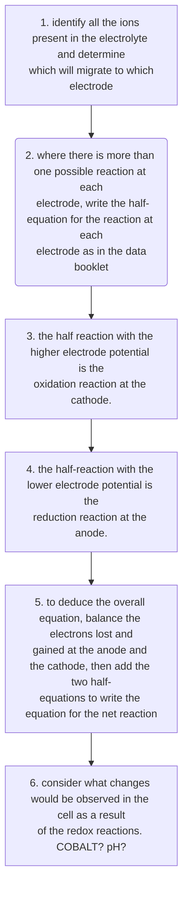

#chem #whatarethemechanismsofchemicalchange   
  
Reactivity 3.2.15 - during electrolysis of aqueous solutions, competing reactions can occur at the anode and cathode, including the oxidation and reduction of water  
  
- the electrolysis of molten salts is different to the electrolysis of aqueous solutions as it is possible for multiple reactions to occur at the anode and cathode  
  
- with $\ce{NaCl(aq)}$, sodium metal cannot be produced at the cathode as it would immediately react with water  
  
the reaction at the cathode can be understood in terms of a sequence of two hypothetical steps  
$$  
\begin{array}{}  
\ce{Na+ +e- \to Na \\  
 Na +H_{2}O \to Na+ +OH- +\frac{1}{2}H_{2} \\ \\  
\cancel{ \ce{Na+} } +e- +\cancel{ \ce{Na} } +H_{2}O \to \cancel{ \ce{Na} } + \cancel{ \ce{Na+} } +OH- +\frac{1}{2}H_{2} \\  
H_{2}O + e- \to OH- + \frac{1}{2}H_{2}  
}  
\end{array}  
$$  
thus, water is preferentially reduced to hydrogen  
  
generally, for a solute $\ce{M+A-(aq)}$, it is possible for there to be more than one redox reaction possible at each electrode:  
- anode: either $A-$ or $\ce{H_{2}O}$ can be oxidised  
- cathode: either $\ce{M+}$ or $\ce{H_{2}O}$ can be reduced  
  
**selective discharge** is the discharge of an ion at the electrode  
  
###### competing reactions during electrolysis of aqueous solutions  
  

  
###### electrolysis of water  
since pure water is not a good conductor of electricity, some sulfuric acid or sodium hydroxide is added.  
  
  
  
###### electrolysis of $\boldsymbol{\textcolor[rgb]{0.72156863, 0.74117647, 0.95294118}{\ce{NaCl(aq)}}}$  
  
.png)  
overall balanced equation for brine:  
$$  
\begin{array}{}  
 \ce{2H_{2}O(l) \cancel{ \ce{+2e- }}}\ce{+2Cl-(aq)\to H_{2}(g) +2OH-(aq) +Cl_{2}(g) \cancel{ \ce{+2e-} }} \\  
\ce{2H_{2}O(l) +2Cl-(aq)\to 2H_{2}(g) +2OH-(aq) +Cl_{2}(g)}  
\end{array}  
$$  
  
the preferential discharge of $\ce{Cl-}$ occurs at high concentration. $E^{\ominus}$ values depend on the concentration.  
  
###### electrolysis of $\boldsymbol{\ce{CuSO_{4}(aq)}}$ with carbon (graphite) or other inert electrodes  
graphite electrodes:  
  
  
used to precipitate $\ce{Cu(s)}$  
  
copper electrodes:  
  
  
no change in intensity of the blue colour of the solution as $\ce{Cu^{2+}}$ ions are both formed and removed from the solution simultaneously, so the concentration remains constant  
  
this process can be used to purify copper  
- impure copper anode  
- small pure copper cathode  
- the anode erodes as copper ions are formed and transferred to the cathode  
- only copper atoms are formed at the cathode  
- the impurities leave the anode as the copper ions are formed and fall to the bottom of the cell  
  
