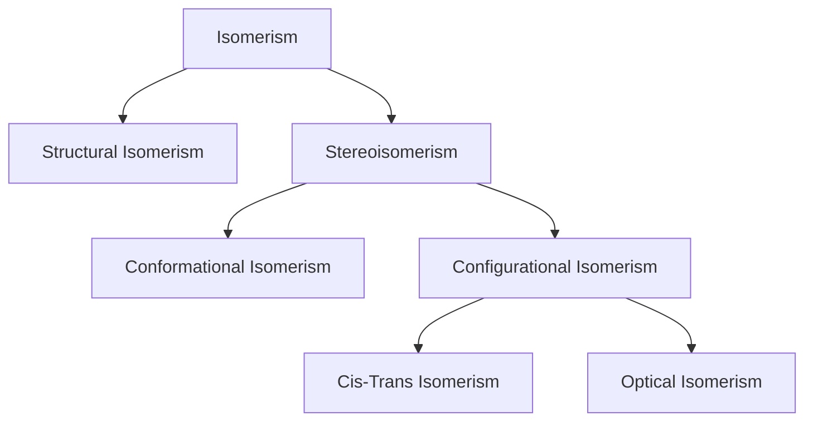

#chem #classificationsofmatter  
  
Structure 3.2.7 - stereoisomers have the same constitution (atom identities, connectivities and bond multiplicities) but different spatial arrangements of atoms  
  
**stereoisomerism** has molecules with atoms attached in the same order, but differing in spatial arrangement, requiring three-dimensional representation  
  

  
conformational isomers **spontaneously** interconvert through bond rotations, and so cannot be isolated separately. some conformers of a compound are more stable, so are favoured. (not required for ib)  
  
configurational isomers have a **permanent** difference in their geometry. these cannot be interconverted and exist as separate compounds with distinct properties.  
  
##### cis-trans isomers and alkenes and cyclic molecules  
###### double-bonded molecules  
the double bond consists of 1 sigma bond and 1 pi bond. free rotation around the double bond would not be possible as the $\text{p}$ orbitals would be pushed out of position, breaking the pi bond. this is why double-bonded molecules can have stereoisomers  
  
the reference plane is perpendicular to the sigma bonds and passes through the double bond.  
  
when the molecule contains two or more different groups attached to the double bonded carbons, they can be arranged to give two isomers. the simplest, involving 2 different substituents, form ***cis*** and ***trans* isomers**. the prefixes are given in italics before the name  
  
- *cis* refers to the isomer that has the same groups on the same side of the double bond or ring  
- *trans* refers to the isomer that has the same groups on opposite sides  
  
  
  
  
###### cyclic molecules  
cycloalkanes contain a ring of carbon atoms that restricts rotation. the bond angles are strained from the tetrahedral angles in the parent alkane. in cyclopropane, the atoms form an equilateral triangle   
```smiles  
c1cc1  
```  
  
in cyclobutane, the atoms form a puckered square with approximate angles of 90˚   
  
  
  
  
the position relative to the plane of the ring defines the isomer. note that the substituted groups do not have to be on adjacent carbon atoms.  
  
1,3-dichlorocyclobutane and 1,2-dichlorocyclobutane would be positional structural isomers  
  
##### optical isomers  
a carbon atom attached to ==four *different* atoms or groups== is known as **chiral**, **asymmetric**, or a **stereocentre**. the four groups, arranged tetrahedrally around the carbon atom with bond angles of 109.5˚, can be arranged in two different 3D configurations which are mirror images, known as **enantiomers**. they are said to be **chiral molecules** and have no plane of symmetry. they are said to be **non-superimposable**  
  
enantiomers have opposite configurations at each chiral centre. some molecules have different configurations at one or more, *but not all*, chiral centres, known as **diastereomers** and are not mirror images of each other. eg. glucose and galactose. common sugars are often diastereomers of each other.  
  
  
  
  
  
###### properties of enantiomers  
  
- diastereomers usually differ in both physical and chemical properties.  
  
enantiomers have identical physical and chemical properties with **2 exceptions**  
- optical activity  
- reactivity with other chiral molecules  
  
  
  
==**optical activity**==  
optical isomers show a difference in a specific interaction with light  
  
regular light consists of electromagnetic waves that oscillate in an infinite amount of planes at right angles to the direction of travel. passing this light through a **polariser** only allows light oscillating in 1 plane pass through. this is known as **plane-polarised light**.   
  
a solution of optical isomers rotates plane-polarised light when a beam of it is passed through, which can be measured with a **polarimeter**  
  
  
  
the analyser can be rotated until the light passes through it, so the angle of rotation ($\theta$) can be found. in order to compare different solutions, the concentration of the wavelength, the wavelength of light used, and the same path length must be kept the same  
  
separate solutions of enantiomers, at the same concentration, rotate plane-polarised light in equal amounts but in opposite directions, **optically active**.   
  
a **racemic mixture** of a chiral compound contains **equal concentrations** of the two optical isomers. the rotation caused by each is cancelled out, so it is **optically inactive**.  
  
- naturally occurring chiral molecules are optically active, and exist as only 1 enantiomer  
- (-) enantiomers rotates light left  
- (+) enantiomers rotates light right  
  
  
**==reactivity with other chiral molecules==**  
  
**resolution** is when a racemic mixture is mixed with a single enantiomer of another chiral compound, reacting to produce different products (because of the two enantiomers in the mixture) - with *distinct chemical and physical properties* - which can be separated.  
  
**asymmetric synthesis** is the process for the manufacture of a single enantiomer using a chiral catalyst.  
  
biological systems are chiral environments - thalidomide  
  
##### challenge questions  
4. *cis-trans* isomerism can occur in inorganic as well as in organic compounds. think about why it can occur in square planar or octahedral complexes but not in tetrahedral complexes.  
  
in both square planar and octahedral complexes, groups can be adjacent or across from each other, but in tetrahedral complexes, all groups are adjacent to each other.  
  
5. *cis*-butenedioic acid forms intramolecular hydrogen bonds at the expense of intermolecular bonds. consider what impact this may have on the physical properties and acid strength of the two isomers.  
  
```smiles  
C(=O)(O)/C=C\C(=O)(O)  
```  
  
the melting/boiling point of *cis*-butenedioic acid will be much lower than *trans*-butenedioic acid as it forms less intermolecular bonds  
  
the solubility of *cis*-butenedioic acid is higher as it is a polar molecule (in *trans*-butenedioic acid, there is not a net dipole moment since it is symmetrical and is thus cancelled).   
```smiles  
C(=O)(O)\C=C\C(=O)(O)  
```  
  
when the $\ce{H+}$ ion is lost, the *cis* anion is more stable than the *trans* form, so the *cis*-butenedioic acid will be a stronger acid.  
  
6. the structure of taxol, an anti-cancer drug, is given below. taxol contains 11 chiral carbons. can you find them all?  
  
